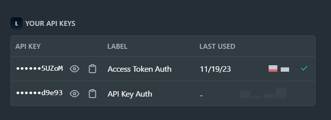
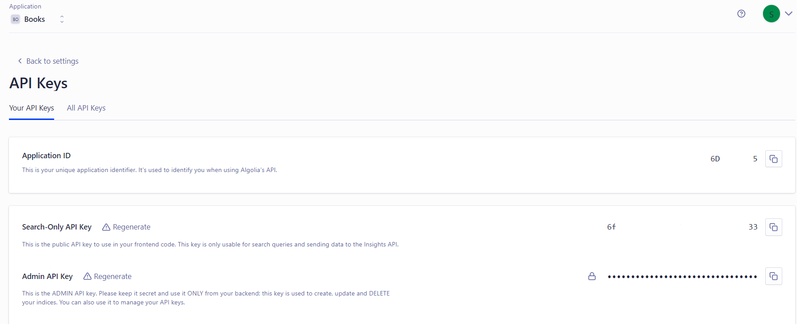

### Movie Recommendation
<div style="text-align: center;">
  
</div>
<hr>

#### Dependencies
To install the required Python packages you can use the following command:

```bash
pip install -r requirements.txt
```

- Run `model.ipynb` & `dataset.ipynb`
- Edit `api.py`
  - Create an account at <a href='https://www.algolia.com/users/sign_in'>Algolia</a>
  - Create your index and upload records of `movies_dataset.csv`
  - Create an account at  <a href='https://developer.themoviedb.org/reference/intro/authentication#api-key-quick-start'>TMDb</a>
  - Get your API and edit on api.py
  <p align="center">
    
    
  </p>

  ```
  # TMDB API Key Auth
  TMDB_API_KEY = '_______________' 

  # Algolia API Search

  ALGOLIA_APP_ID = '____________'
  ALGOLIA_API_KEY = '______________________'
  ALGOLIA_INDEX_NAME = '_______________________'
  ```
  *Note: </br>Run ```py api.py``` with Test Cases 1 & 2 to check request*
  </br>
- Run `app.py`
  To run the app.py, load the dependecies requirements, edit `api.py` and use the following command:
  
  ```
  py app.py
  ```
✨ Enjoy the demo
<hr>
Feel free to send issues if you face any problem. </br>
✨ Don't forget to star the repo :)